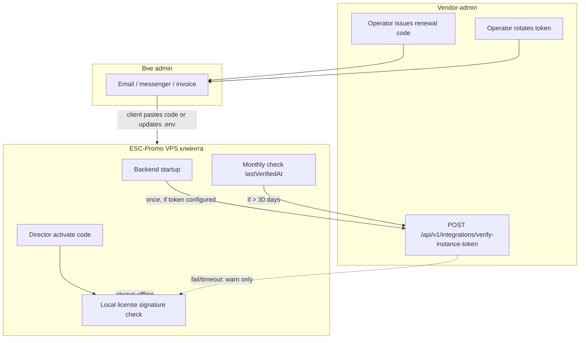

# Спека: скелетон vendor-admin + жёсткая граница API с ESC-Promo

> **Статус:** принято (документация). Реализация — Chunk 0.  
> **Полное ТЗ:** `VENDOR_ADMIN_SPEC.md` (чанки 1–12).  
> **Интеграция:** `VENDOR_INTEGRATION.md` §0, §4.3.  
> **Референс коробки:** `docs/reference/esc-promo/` (read-only копии из `C:\ESC-Promo`).

---

## 1. Назначение документа

1. **Скелетон (Chunk 0)** — минимальный monorepo, который поднимается локально и готов к последовательной генерации чанков 1–12.
2. **Жёсткая граница API** — единственный канон того, **когда и зачем** коробка ESC-Promo обращается к vendor-admin по сети.

**Не дублирует:** полный REST admin API (§8 `VENDOR_ADMIN_SPEC.md`), бизнес-модули sales/pricing, UI-страницы beyond login shell.

---

## 2. Принципы интеграции (обязательные)

| # | Правило | Последствие |
|---|---------|-------------|
| R1 | **Offline-first** — runtime коробки не зависит от доступности admin | Сбой/timeout online-проверки **не блокирует** работу при валидной локальной лицензии |
| R2 | **Online к admin — только проверка integration token** | Коробка вызывает admin **только** `POST /api/v1/integrations/verify-instance-token` |
| R3 | **Два момента вызова** | (a) **первый старт** backend после настройки token; (b) **периодически** — раз в **30 суток** (канон: [`BOX_PRODUCT_SPEC.md`](../reference/esc-promo/BOX_PRODUCT_SPEC.md) §4.3, `MONTH_MS`) |
| R4 | **Активация — локально** | `POST /api/license/activate` **никогда** не требует online admin; подпись проверяется через `LICENSE_PUBLIC_KEY` |
| R5 | **Продление — вне admin** | После оплаты operator **вручную** передаёт клиенту renewal-код или новый integration token **вне UI admin** (email, мессенджер, счёт) |
| R6 | **Admin не пушит в коробку** | Нет webhook/callback в коробку для renewal, rotate token, revoke — только генерация в admin + ручная доставка |
| R7 | **Два канона API не смешивать** | Admin API — `VENDOR_ADMIN_SPEC.md` §8; коробка — `docs/reference/esc-promo/API_CONTRACT.md` §2 |



---

## 3. Жёсткие правила API: ESC-Promo → vendor-admin

### 3.1 Разрешено (license lifecycle)

| Момент | Endpoint | Auth | Timeout | При ошибке |
|--------|----------|------|---------|------------|
| Первый старт backend (token в `.env`) | `POST /api/v1/integrations/verify-instance-token` | `X-Instance-Token` | **3 s** | log warning; **не** блокировать старт |
| Периодическая проверка (≥ 30 суток с `lastVerifiedAt`) | тот же | тот же | **3 s** | log warning; локальная лицензия остаётся источником истины |

**Запрос:**

```http
POST /api/v1/integrations/verify-instance-token
Content-Type: application/json
X-Instance-Token: <VENDOR_ADMIN_INSTANCE_TOKEN>
```

```json
{
  "runtimeInstanceId": "a1b2c3d4e5f6g7h8i9j0k1l2",
  "productVersion": "1.0.0",
  "licenseStatus": "active",
  "validUntil": "2027-06-14T23:59:59.000Z",
  "reportedAt": "2026-06-29T10:00:00.000Z"
}
```

**Ответ `200`:**

```json
{
  "success": true,
  "data": {
    "tokenValid": true,
    "instanceRegistered": true,
    "licenseActive": true,
    "validUntil": "2027-06-14T23:59:59.000Z",
    "modules": ["pro"],
    "nextCheckAfterDays": 30,
    "warnings": []
  },
  "error": null
}
```

**Ответы ошибок (не блокируют offline runtime):**

| HTTP | code | Значение для коробки |
|------|------|----------------------|
| 401 | `INVALID_INSTANCE_TOKEN` | token отозван/неверный → banner director «свяжитесь с support»; **grace/expired по локальной лицензии** |
| 403 | `INSTANCE_SUSPENDED` | инстанс деактивирован в admin → banner; локальный режим по `validUntil` |
| 404 | `INSTANCE_NOT_FOUND` | token не привязан → warning |
| 5xx / timeout | — | ignore; `lastVerifiedAt` **не** обновлять |

**Поведение admin при успехе:** обновить `instances.last_token_verified_at`, audit log `integration.token_verified`.

### 3.2 Запрещено из runtime коробки (license lifecycle)

| Вызов | Статус | Причина |
|-------|--------|---------|
| Polling чаще 1 раз / 30 суток | **Запрещено** | R3 |
| Heartbeat / telemetry | Phase 2 | R6 |
| Activation callback | Phase 2 | R6 |
| Auto-fetch renewal code | **Запрещено** | R5, R6 |
| Любой inbound webhook в коробку от admin | **Запрещено** | R6 |

### 3.3 Исключения (не license lifecycle)

Эти endpoint'ы **не заменяют** периодическую проверку token и **не добавляют** новых online-моментов:

| Endpoint | Когда | MVP skeleton |
|----------|-------|:------------:|
| `POST /api/v1/integrations/verify-code` | **Один раз** перед activate, только если `VENDOR_ADMIN_VERIFY_ENABLED=true` | stub route, реализация Chunk 7 |
| Support chat `/api/v1/integrations/support/*` | По действию director в UI | Phase 2 (не в skeleton) |

**Skeleton (Chunk 0):** реализовать только `verify-instance-token` + health; остальные integration routes — заглушки `501 NOT_IMPLEMENTED`.

---

## 4. Продление и оплата (ручной канал)

### 4.1 Сроки (канон)

| Тип | Срок | Источник |
|-----|------|----------|
| initial / renewal | **365 дней** | `VENDOR_INTEGRATION.md` §5.1 |
| pilot | **30 дней** | §5.2 |
| grace на коробке | **14 дней** после `validUntil` | `BOX_PRODUCT_SPEC.md` §4.3 |
| период online token check | **30 суток** | §4.3 (`lastVerifiedAt`) |

### 4.2 Flow после оплаты (вне admin UI доставки)

1. Клиент оплачивает **вне admin** (счёт, договор, банк).
2. Operator в admin:
   - **Вариант A:** `POST /licenses/:id/codes` `{ "codeType": "renewal" }` → копирует код.
   - **Вариант B:** `POST /integrations/instances/:id/rotate-token` → копирует новый token.
3. Operator **передаёт A или B клиенту вручную** (email, Telegram, телефон) — **не через API коробки**.
4. Клиент:
   - **A:** director → поле «Код активации» → локальный activate (offline).
   - **B:** обновляет `.env` → restart → первый старт → `verify-instance-token`.

**Запрещено:** auto-email из admin, push notification в коробку, «pull renewal» endpoint на коробке.

### 4.3 Dashboard admin (напоминание, не автодоставка)

- Виджеты «renewals due» 30/14/7 дней — **только для operator**.
- Генерация кода/token — по клику operator; доставка — **вне системы**.

---

## 5. Скелетон monorepo (Chunk 0)

### 5.1 Scope Chunk 0

| Включить | Исключить (чанки 1+) |
|----------|----------------------|
| `pnpm-workspace.yaml`, root `package.json` | `license-signing` реализация |
| `docker-compose.yml` (mysql + api + web) | CRUD customers/sales/licenses |
| `apps/api`: Express, config, error handler, `/status` | JWT auth (Chunk 2) |
| `POST /api/v1/integrations/verify-instance-token` (минимальная валидация token hash) | Полная БД-схема §15 |
| `apps/web`: Vite shell, placeholder layout, `/login` stub | Реальный login |
| `.env.example`, `README` секция dev | Seed, migrate полная схема |
| CI scripts: `build`, `test:run` (smoke) | Integration tests бизнес-логики |

### 5.2 Структура файлов (минимум)

```
ESC-Admin/
├── package.json
├── pnpm-workspace.yaml
├── docker-compose.yml
├── .env.example
├── packages/
│   └── license-signing/          # package.json + stub index.ts (Chunk 1)
├── apps/
│   ├── api/
│   │   ├── package.json
│   │   ├── tsconfig.json
│   │   ├── Dockerfile
│   │   └── src/
│   │       ├── index.ts
│   │       ├── app.ts
│   │       ├── config/environment.ts
│   │       ├── middleware/errorHandler.ts
│   │       ├── middleware/instanceTokenAuth.ts
│   │       ├── routes/
│   │       │   ├── status.ts
│   │       │   └── integrations.ts   # verify-instance-token
│   │       └── utils/apiResponse.ts
│   └── web/
│       ├── package.json
│       ├── vite.config.ts
│       ├── index.html
│       ├── Dockerfile
│       └── src/
│           ├── main.tsx
│           ├── App.tsx
│           └── pages/PlaceholderPage.tsx
└── docs/active/                  # уже существует
```

### 5.3 API skeleton (реализовать в Chunk 0)

| Method | Path | Auth | Chunk |
|--------|------|------|-------|
| GET | `/status` | public | 0 |
| GET | `/status/health` | public | 0 |
| POST | `/api/v1/integrations/verify-instance-token` | `X-Instance-Token` | 0 |
| POST | `/api/v1/integrations/verify-code` | `X-Instance-Token` | 7 (stub 501) |
| POST | `/api/v1/auth/login` | public | 2 (stub 501) |

**Envelope (все JSON-ответы):**

```json
{ "success": true, "data": {}, "error": null }
```

```json
{ "success": false, "data": null, "error": { "code": "INVALID_INSTANCE_TOKEN", "message": "..." } }
```

### 5.4 БД skeleton

Chunk 0 — допускается in-memory stub для token hash, но **предпочтительно сразу с MySQL 8**:

- **Рекомендация Chunk 0:** mysql в docker-compose, миграция `001_skeleton.sql` только таблица `instances` (минимум для verify-token):

```sql
CREATE TABLE instances (
  id CHAR(36) NOT NULL PRIMARY KEY,
  runtime_instance_id VARCHAR(24),
  integration_token_hash VARCHAR(64) NOT NULL,
  integration_token_issued_at DATETIME NOT NULL DEFAULT CURRENT_TIMESTAMP,
  last_token_verified_at DATETIME NULL,
  instance_status VARCHAR(20) NOT NULL DEFAULT 'planned',
  created_at DATETIME NOT NULL DEFAULT CURRENT_TIMESTAMP
);
```

Полная схема — `VENDOR_ADMIN_SPEC.md` §15, миграция в Chunk 2–3.

### 5.5 Environment

**vendor-admin `.env.example` (дополнение к §12 spec):**

```bash
# Integration
INTEGRATION_TOKEN_VERIFY_TIMEOUT_MS=3000
INTEGRATION_TOKEN_CHECK_INTERVAL_DAYS=30   # документированный интервал для ESC-Promo
```

**ESC-Promo `.env` (канон для integration — не редактировать в ESC-Admin, только ссылка):**

```bash
VENDOR_ADMIN_URL=https://admin.example.com
VENDOR_ADMIN_INSTANCE_TOKEN=<from-admin-display-once>
VENDOR_ADMIN_VERIFY_ENABLED=false          # verify-code at activate; NOT periodic check
# Periodic token check uses VENDOR_ADMIN_URL + TOKEN always when both set
```

### 5.6 Root scripts

```json
{
  "scripts": {
    "dev": "pnpm -r --parallel dev",
    "build": "pnpm -r build",
    "test:run": "pnpm -r test:run",
    "docker:up": "docker compose up -d",
    "docker:down": "docker compose down"
  }
}
```

---

## 6. Контракт для ESC-Promo (что менять в `C:\ESC-Promo`)

> Референс-копии в `docs/reference/esc-promo/` обновляются **перекопированием из ESC-Promo**, не правкой здесь.

При реализации на стороне коробки (отдельная задача ESC-Promo):

| Файл | Изменение |
|------|-----------|
| `src/backend/modules/license/vendorIntegration.js` (новый) | `verifyInstanceTokenOnStartup()`, `verifyInstanceTokenIfDue()` |
| `src/backend/server.js` | после load license — вызов startup verify (async, non-blocking) |
| `src/backend/modules/license/service.js` | при `lastVerifiedAt > MONTH_MS` — online verify (не только локальный bump) |
| `docs/active/API_CONTRACT.md` §2.3 | зафиксировать `verify-instance-token` как единственный periodic outbound |
| `docs/active/VENDOR_INTEGRATION.md` | синхронизировать с ESC-Admin §0 |

**Жёсткий запрет в коде коробки:** не добавлять cron/interval < 30 суток для вызовов admin; не блокировать HTTP API коробки при недоступности admin.

---

## 7. Критерии приёмки Chunk 0

1. `pnpm install && pnpm docker:up && pnpm dev` — API `:4000`, web `:5174`.
2. `GET /status` → `status: OK`.
3. Seed/dev: один test instance с известным token hash в БД.
4. `POST /api/v1/integrations/verify-instance-token` с валидным token → `200`, `tokenValid: true`.
5. Невалидный token → `401 INVALID_INSTANCE_TOKEN`.
6. Timeout middleware ≤ 3s на integration routes.
7. `pnpm build && pnpm test:run` — green (smoke).
8. `LICENSE_PRIVATE_KEY` отсутствует в `apps/web/dist`.
9. Документ `VENDOR_INTEGRATION.md` §0 ссылается на этот файл.

---

## 8. Промпт генерации Chunk 0

```text
Создай monorepo ESC-Admin по docs/active/ADMIN_SKELETON_SPEC.md §5:
структура §5.2, docker-compose, .env.example, apps/api с verify-instance-token (§3.1),
apps/web placeholder, root scripts §5.6.
Соблюдай жёсткие правила API §3 (только verify-instance-token для online license check).
Stack: Node 20, Express 4, TS strict, MySQL 8, React 18, Vite 5, pnpm workspaces.
После — pnpm test:run.
```

---

## 9. Связанные документы

| Документ | Связь |
|----------|-------|
| `VENDOR_ADMIN_SPEC.md` | Полное ТЗ, чанки 1–12, §8 REST |
| `VENDOR_INTEGRATION.md` | §0 граница API, §4.3 verify-instance-token |
| `TODO.md` | Chunk 0 → этот документ |
| `docs/reference/esc-promo/BOX_PRODUCT_SPEC.md` | §4.3 offline-first, 30-day check |
| `docs/reference/esc-promo/API_CONTRACT.md` | §2 activate (локально) |
| `C:\ESC-Promo\docs\active\` | Источник правды для изменений коробки |
