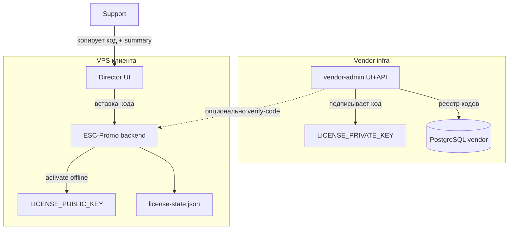

# Интеграция vendor-admin ↔ коробка (ESC-Promo)

> **Статус:** принято (документация). Реализация — MVP-5.  
> **Vendor-admin:** отдельный репо, см. `VENDOR_ADMIN_SPEC.md`.  
> **Коробка:** `ESC-Promo`, activate API — [`API_CONTRACT.md`](../reference/esc-promo/API_CONTRACT.md) §2.2–2.4.  
> **Support chat:** `SUPPORT_CHAT.md` (только в репо ESC-Promo).

---

## 1. Модель доверия



**Принципы:**

| # | Правило |
|---|---------|
| 1 | **Активация offline-first** — коробка не зависит от доступности vendor-admin в runtime. |
| 2 | **Подпись кодов** — единственный обязательный криптоканал; private key только у vendor. |
| 3 | **Online-проверка опциональна** — улучшает UX/support, не блокирует activate при недоступности admin. |
| 4 | **Per-instance token** — выпускает **vendor-admin** при создании инстанса; копируется в `.env` коробки вручную. |
| 5 | **Vendor-admin JWT** — только для входа operator в admin UI; коробка его не использует. |

---

## 2. Нужен ли API-токен?

### 2.1 Без токена (обязательный минимум)

| Операция | Механизм |
|----------|----------|
| Активация лицензии | Подписанный код + `LICENSE_PUBLIC_KEY` на коробке |
| Проверка подписи | Локально в `license/service.js` |
| Verify в admin UI | JWT operator (login/password admin) |
| Public price API | Без auth или `WEBSITE_PRICE_API_KEY` (только сайт, не коробка) |

**Вывод:** для базовой поставки и activate **API-токен коробке не обязателен**.

### 2.2 С токеном (MVP online verify + Phase 2)

| Операция | Header | Кто выпускает |
|----------|--------|---------------|
| Online verify кода | `X-Instance-Token` | **vendor-admin** при создании инстанса |
| Support chat | `X-Instance-Token` | **vendor-admin** (тот же token) |
| Activation callback (Phase 2) | `X-Instance-Token` | тот же token |
| Heartbeat (Phase 2) | `X-Instance-Token` | тот же token |

**Кто выпускает:** **vendor-admin** (принято).  
**Кто прописывает:** support/founder копирует plain token **один раз** из UI инстанса → `.env` коробки.

---

## 3. Per-instance integration token

### 3.1 Выпуск (vendor-admin)

При `POST /instances` (или checkbox «Сгенерировать token»):

1. Генерация `integration_token` — `crypto.randomBytes(32)` → base64url (~43 символа).
2. В БД: `integration_token_hash = sha256(token)`.
3. UI **display once**: модал «Скопируйте в .env коробки».
4. Повторный просмотр: только **rotate** (новый token, старый invalidate).

### 3.2 Поля БД (дополнение к `instances`)

| Колонка | Тип | Описание |
|---------|-----|----------|
| `integration_token_hash` | varchar(64) | sha256 hex |
| `integration_token_issued_at` | timestamptz | |
| `integration_token_rotated_at` | timestamptz | nullable |

### 3.3 Коробка (.env)

```bash
# Опционально — online verify и Phase 2 callback
VENDOR_ADMIN_URL=https://admin.example.com
VENDOR_ADMIN_INSTANCE_TOKEN=<plain-token-from-admin>
VENDOR_ADMIN_VERIFY_ENABLED=true   # default false; true = пробовать verify перед activate
```

| Переменная | Обяз. | Описание |
|------------|:-----:|----------|
| `VENDOR_ADMIN_URL` | если verify/callback | Base URL admin API **без** trailing slash |
| `VENDOR_ADMIN_INSTANCE_TOKEN` | если verify/callback | Plain token из admin |
| `VENDOR_ADMIN_VERIFY_ENABLED` | ❌ | `true` — best-effort verify перед activate |

**ESC-Promo hook (Phase 2):** см. `VENDOR_INTEGRATION.md` §4.4.

### 4.5 Support chat (коробка → admin)

> Канон: **`SUPPORT_CHAT.md`**.

| Операция | Token | MVP |
|----------|-------|:---:|
| Director → support messages | `X-Instance-Token` | ✅ |
| Admin inbox (Box ID + company) | JWT operator | ✅ |

- Thread создаётся при первом сообщении с коробки.
- Admin inbox: колонки **Box ID** + **legal_name**; unlinked thread → `PATCH .../link`.
- Box ID на инстансе — **ручной ввод** (`PATCH /instances/:id`) до/после первого сообщения.
- Чат **не offline** — при недоступности admin UI показывает email fallback.

---

## 4. Каналы обмена

### 4.1 Offline: код активации (основной)

```text
vendor-admin issue code
    → support копирует activationCode
    → director «Код активации» / «Пилот»
    → POST /api/license/activate | activate-pilot
    → локальная verify подписи
```

Формат кода: `base64url(JSON payload).base64(signature)` — см. [`BOX_PRODUCT_SPEC.md`](../reference/esc-promo/BOX_PRODUCT_SPEC.md) §4.2.

### 4.2 «Публичная часть» кода (для клиента/support)

Payload **не секретен** (base64url декодируется без private key). Support отправляет клиенту **два блока**:

**A. Summary (человекочитаемо):**

```text
Пакет: Рег.Про
Модули: pro
Действует до: 2027-06-14
Тип: initial | renewal | pilot
License ID: 550e8400-e29b-41d4-a716-446655440000
```

**B. Activation code (полная строка для вставки):**

```text
eyJsaWNlbnNlSWQiOi... . MEUCIQ...
```

Клиент вставляет только **B** в director UI. **A** — для сверки и support.

### 4.3 Online: verify-code (MVP, опционально)

**Направление:** коробка → vendor-admin (best-effort, timeout 3s).

**POST** `{VENDOR_ADMIN_URL}/api/v1/integrations/verify-code`

Headers:

```http
Content-Type: application/json
X-Instance-Token: <VENDOR_ADMIN_INSTANCE_TOKEN>
```

Request:

```json
{
  "activationCode": "eyJ...signature",
  "runtimeInstanceId": "a1b2c3d4e5f6g7h8i9j0k1l2"
}
```

Response `200`:

```json
{
  "success": true,
  "data": {
    "valid": true,
    "registered": true,
    "revoked": false,
    "codeType": "initial",
    "licenseId": "uuid",
    "validUntil": "2027-06-14T23:59:59.000Z",
    "modules": ["pro"],
    "warnings": []
  },
  "error": null
}
```

**Поведение коробки:**

- `VENDOR_ADMIN_VERIFY_ENABLED=false` или нет URL/token → skip, сразу local activate.
- Verify fail / timeout / 5xx → **warning в лог**, local activate **всё равно разрешён** (offline-first).
- Verify `valid: false` + `revoked: true` → **block activate**, toast director «код отозван».

**Auth admin UI** (`POST /codes/verify` с JWT) — отдельный endpoint для operator; token инстанса не нужен.

### 4.4 Phase 2: callback и heartbeat

См. `VENDOR_ADMIN_SPEC.md` §8.13. Тот же `X-Instance-Token`.

---

## 5. Жизненный цикл кодов

### 5.1 Production / renewal (1 год)

| Параметр | Значение |
|----------|----------|
| Срок `validUntil` | **365 дней** от `sold_at` (initial) или +365d (renewal) |
| Авто-refresh | **Нет** — renewal-код выдаёт operator вручную из admin |
| Счётчик в admin | Dashboard «renewals due» 30/14/7 дней |
| После истечения | Grace 14 дней на коробке (read-only), затем renewal-код |

**Renewal flow:**

1. Dashboard показывает лицензию в окне 30/14/7 дней.
2. Operator вручную: `POST /licenses/:id/codes` `{ "codeType": "renewal" }`.
3. Клиент вставляет код в director (как initial).

### 5.2 Pilot (1 месяц)

| Параметр | Значение |
|----------|----------|
| Поле UI коробки | **«Пилот»** (`POST /api/license/activate-pilot`) |
| Срок | **30 дней** (`pilotUntil` в payload) |
| Генерация | Отдельный код `codeType: pilot` в admin |
| Повторы | **Разрешены несколько пилотов подряд** (новый pilot-код после истечения предыдущего) |
| Совместимость | Pilot на **полноценной** коробке (production build), не отдельный дистрибутив |

Admin: каждый pilot — отдельная запись в `activation_codes`; история видна на карточке license.

### 5.3 Addon / reissue

Без изменений: `addon` — merge modules; `reissue` — смена VPS (`LIC-REISSUE`).

---

## 6. Развёртывание vendor-admin

Один codebase; режим задаётся `.env`.

| Режим | `VENDOR_ADMIN_PUBLIC_URL` | Пример |
|-------|---------------------------|--------|
| **VPS (prod)** | Постоянный IP или домен + HTTPS | `https://admin.regpoint.vendor` |
| **Local dev** | localhost | `http://localhost:4000` |
| **Staging** | Внутренний URL / VPN | `https://admin-staging.internal` |

**Требования:**

- `VENDOR_ADMIN_PUBLIC_URL` — URL, который прописывают в `VENDOR_ADMIN_URL` на коробках этого контура.
- CORS web UI: `WEB_ORIGIN` = URL фронта admin (может отличаться от API при reverse proxy).
- TLS на VPS обязателен для prod; local — HTTP допустим.
- Bind: `0.0.0.0` в Docker; firewall — только нужные порты.

**Проверка после деплоя:**

```bash
curl -s "${VENDOR_ADMIN_PUBLIC_URL}/status"
curl -s "${VENDOR_ADMIN_PUBLIC_URL}/api/v1/public/price-list/current"
```

Коробки **не** hardcode URL — только через `.env`.

---

## 7. Учётная запись operator (MVP)

| Параметр | Значение |
|----------|----------|
| Количество users | 1 (founder) |
| Роль | `admin` |
| Создание | `pnpm db:seed` или first-boot script |
| Пароль | **Генерируется случайно при seed**, выводится **один раз** в stdout |
| Хранение | bcrypt hash в `users`; plain password **не** в git |
| `.env.example` | Только placeholders, без реальных credentials |
| Смена пароля | Phase 2 UI; MVP — `scripts/reset-admin-password.ts` |

**Пример вывода seed:**

```text
=== Vendor Admin seeded ===
Email:    admin@vendor.local
Password: K7m#xQ9pL2nR  (SAVE NOW — not shown again)
URL:      http://localhost:4000
```

Email можно переопределить через `SEED_ADMIN_EMAIL`; password — всегда random unless `SEED_ADMIN_PASSWORD` в dev-only `.env`.

---

## 8. Переменные окружения (сводка)

### 8.1 vendor-admin

| Variable | Required | Description |
|----------|:--------:|-------------|
| `VENDOR_ADMIN_PUBLIC_URL` | ✅ | Canonical URL для ссылок и `.env` коробок |
| `LICENSE_PRIVATE_KEY` | ✅ | Подпись кодов |
| `LICENSE_PUBLIC_KEY` | ✅ | Verify в admin |
| `JWT_SECRET` | ✅ | Admin login |
| `DATABASE_URL` | ✅ | PostgreSQL |
| `CODES_ENCRYPTION_KEY` | ✅ | At-rest encryption кодов |
| `WEBSITE_PRICE_API_KEY` | ❌ | Public price API |
| `PUBLIC_CORS_ORIGINS` | ❌ | Marketing site |

### 8.2 коробка (ESC-Promo)

| Variable | Required | Description |
|----------|:--------:|-------------|
| `LICENSE_PUBLIC_KEY` | ✅ prod | Пара к vendor private key |
| `VENDOR_ADMIN_URL` | ❌ | Для online verify / callback |
| `VENDOR_ADMIN_INSTANCE_TOKEN` | ❌ | Per-instance, из admin |
| `VENDOR_ADMIN_VERIFY_ENABLED` | ❌ | default `false` |

---

## 9. Безопасность (чеклист)

- [ ] `LICENSE_PRIVATE_KEY` не в ESC-Promo repo и не в client Docker image
- [ ] Integration token — display once; в БД только hash
- [ ] HTTPS на prod admin
- [ ] Rate limit: `/auth/login`, `/integrations/verify-code`
- [ ] Verify timeout 3s — не блокирует offline activate
- [ ] Audit log: issue code, rotate token, login
- [ ] Admin password — random at seed, не коммитить

---

## 10. Связанные документы

| Документ | Раздел |
|----------|--------|
| `VENDOR_ADMIN_SPEC.md` | Полное ТЗ admin, API §8 |
| [`BOX_PRODUCT_SPEC.md`](../reference/esc-promo/BOX_PRODUCT_SPEC.md) | §4.3–4.5 лицензия на коробке |
| [`API_CONTRACT.md`](../reference/esc-promo/API_CONTRACT.md) | §2.2 activate; §2.3–2.4 vendor integration + support |
| [`ARCHITECTURE.md`](../reference/esc-promo/ARCHITECTURE.md) | §5.4 trust boundary |
| `TODO.md` | MVP backlog |
| `SUPPORT_CHAT.md` | ESC-Promo repo — support chat |
