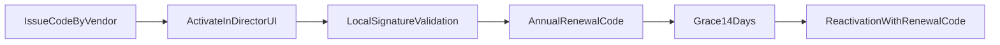

# Спецификация коробочного продукта Рег.Промо

> **Статус:** принято. Self-hosted «коробка», не SaaS.  
> **Связь:** `BUSINESS_MODEL.md`, `ARCHITECTURE.md`, `DOCKER_VPS_REQUIREMENTS.md`, `EVENT_REGISTRATION_PILOT.md`, `FNS_RECEIPT_VERIFICATION.md`.

---

## 1. Область

| В scope коробки | Вне scope (без отдельного решения) |
|-----------------|-------------------------------------|
| Один инстанс на VPS клиента (Docker) | Multi-tenant platform admin |
| Лицензия по модулям (Рег.Поинт / Рег.Промо / Рег.Про / Рег.Тикет) | Оплата и биллинг внутри приложения |
| 152-ФЗ compliance во **всех** пакетах | Хостинг SaaS у vendor |
| Соглашение о ПД — **на каждое мероприятие своё**, ввод director/manager | Единый текст ПД на весь инстанс без per-event |
| Обновления по подписке (год 1 в лицензии) | |

---

## 2. Поставка клиенту (deliverables)

1. **Docker-образы** (или `docker-compose` + инструкция): frontend, backend, MySQL.
2. **Код активации** (primary UX) + fallback `license.json` (`LICENSE_KEY`) — модули, срок, `instance_id`.
3. **`.env.example`** — переменные без секретов; клиент заполняет на своём VPS.
4. **Runbook деплоя** — `docs/active/BOX_DEPLOY_RUNBOOK.md` (создаётся в Sprint B).
5. **Краткая инструкция** director: создание мероприятия, блок ПД, бэкап.

### 2.1 Стратегия модульной поставки (принято)

Для коробки принимается модель **single distribution + license gating**:

1. В инстанс поставляется **единый дистрибутив** (ядро + все модульные компоненты в коде/образах).
2. Доступность функций определяется **лицензией** (`license.json`) и проверками модулей на backend/frontend.
3. Неактивные модули не удаляются из поставки, но их endpoint'ы и UI-сценарии блокируются (403/hidden UI).

Почему так:
- проще обновления и поддержка (один pipeline, один набор артефактов);
- ниже риск рассинхронизации версий модулей между клиентами;
- быстрее восстановление/миграции on-prem.

Модель «отдельная установка каждого модуля поверх ядра» в текущей волне **не используется** (слишком высокая операционная сложность для MVP Box).

---

## 3. Docker

### 3.1 Сервисы

```yaml
# Целевая схема docker-compose (Sprint B)
services:
  mysql:      # MySQL 8.0, volume data, healthcheck
  backend:    # Node 20, Express, порт 3001 internal
  frontend:   # Nginx + статика SPA, порты 80/443
```

### 3.2 Требования

- См. **`DOCKER_VPS_REQUIREMENTS.md`**: RAM 2–4 GB, SSD, Ubuntu 22.04+.
- HTTPS — Let's Encrypt (certbot) или сертификат клиента; апсейл «настройка SSL» — `BUSINESS_MODEL.md` §5.
- Бэкап MySQL — volume + cron `mysqldump` (ежедневно, хранение 7–30 дней).
- Логи — stdout контейнеров + ротация на хосте.

### 3.3 Переменные окружения (минимум)

| Переменная | Назначение |
|------------|------------|
| `NODE_ENV` | `production` |
| `DB_HOST`, `DB_USER`, `DB_PASSWORD`, `DB_NAME` | MySQL |
| `JWT_SECRET`, `ENCRYPTION_KEY` | Auth и шифрование ПД |
| `FRONTEND_URL` | Публичные ссылки QR/регистрация |
| `LICENSE_FILE` / `LICENSE_KEY` | Проверка лицензии и модулей |
| `FNS_MASTER_TOKEN` | Рег.Про; **уникален для каждого инстанса** — см. `FNS_RECEIPT_VERIFICATION.md`, `FNS_KKT_APPLICATION_PACK.md` |

---

## 4. Лицензирование (техническая реализация)

### 4.1 Модель

- **1 лицензия = 1 инстанс = 1 юрлицо заказчика.**
- Лицензия хранит **продуктовые ключи** `modules`: `point`, `promo`, `pro`, `ticket`.
- Код активации — основной UX в кабинете; `license.json` остаётся fallback-каналом support/DevOps.
- Для production доступны только модули с валидным ключом активации (или валидным pilot-ключом).

### 4.1.1 Product keys vs runtime capabilities

| Уровень | Значение |
|---|---|
| Ключи в `license.json` (канон) | `point`, `promo`, `pro`, `ticket` |
| Runtime-capabilities (вычисляются backend) | `attendance_list`, `pre_registration`, `promo`, `ticketing` |

Правила вычисления capabilities:

- `point` -> `attendance_list`, `pre_registration` (единый тариф и единый ключ).
- `promo` -> `promo` + переиспользование базовых потоков регистрации/check-in по правилам сценария.
- `pro` -> всё из `point` и `promo` + receipts/FNS.
- `ticket` -> `ticketing` + переиспользование потоков `point` по правилам тикетинга.

### 4.2 Файл лицензии (черновик формата)

```json
{
  "licenseId": "uuid",
  "customerName": "ООО Пример",
  "package": "regpoint_pro",
  "modules": ["pro"],
  "issuedAt": "2026-07-01",
  "validUntil": "2027-06-30",
  "instanceId": "hash-of-host-or-manual-id",
  "lastVerifiedAt": "2026-07-01",
  "pilot": {
    "enabled": false,
    "pilotUntil": null
  },
  "signature": "base64-ed25519..."
}
```

### 4.2.1 Код активации (primary UX)

```text
RGPT-PRO1-A7K9-M2P4-Q8R3
```

- Генерируется vendor-side (`scripts/issue-license.js`) вместе с подписанным payload.
- Вводится director в поле **«Код активации»** на странице лицензии.
- Дополнительное поле **«Пилот»** принимает специальный pilot-код сроком на 1 месяц.

### 4.3 Поведение приложения

- Offline-first: одноразовая активация кодом, далее локальная проверка подписи без постоянного online-пинга.
- При старте backend: загрузка лицензии, проверка подписи, `instanceId` и `validUntil`.
- Привязка к инстансу: после первой активации ключ действует только для зафиксированного `instanceId`.
- Ежемесячная локальная перепроверка (`lastVerifiedAt`) + проверка на каждом старте backend.
- **Grace period:** 14 дней после `validUntil` — только чтение + banner «продлите подписку»; запись блокируется (кроме audit).
- API возвращает `403 LICENSE_MODULE_DISABLED` при вызове модуля вне пакета.
- UI: скрыть/create disabled для недоступных `event_mode` и пунктов меню.
- Страница **«О лицензии»** (director): пакет, срок, модули, **ID коробки** (`instance_id`), поле «Код активации», поле «Пилот»; см. **`SUPPORT_CHAT.md`**.
- Dev-режим: допускается отдельный env-флаг для полного доступа к модулям (`NODE_ENV=development` only).
- Текущая реализация: `src/backend/modules/license/service.js`, `src/backend/modules/license/middleware.js`, `src/backend/modules/license/routes.js`.
- Переменные: `LICENSE_PUBLIC_KEY`, `LICENSE_STATE_FILE`, `LICENSE_DEV_MODULES`, `INSTANCE_ID` (optional), `LICENSE_ALLOW_UNSIGNED` (dev/test only).

### 4.4 Генерация лицензий

- Инструмент vendor-side: `scripts/issue-license.js` (не в образе клиента).
- Подпись приватным ключом vendor; публичный ключ в backend (`LICENSE_PUBLIC_KEY`).

### 4.5 Lifecycle, поддержка и продление



- Подписка продлевается ежегодно: support выдаёт renewal-код или signed `license.json`.
- Support сверяет `instance_id`, срок и историю активаций перед перевыпуском.
- In-app уведомления: минимум за 30/14/7 дней до окончания и в режиме grace.
- **Vendor-admin** (отдельный репо): реестр, генерация renewal/pilot — **вручную**. См. **`VENDOR_INTEGRATION.md`**.

### 4.6 Связь с vendor-admin (интеграция)

> Канон: **`VENDOR_INTEGRATION.md`**.

| Канал | MVP | Описание |
|-------|:---:|----------|
| Offline activate | ✅ | Director вставляет код; verify локально через `LICENSE_PUBLIC_KEY` |
| Online verify-code | ✅ опц. | Коробка → admin при `VENDOR_ADMIN_URL` + `VENDOR_ADMIN_INSTANCE_TOKEN` |
| Activation callback | ❌ Phase 2 | Admin узнаёт об activate автоматически |

**Сроки кодов:** production/renewal **365 дней** (renewal вручную); pilot **30 дней** (несколько подряд); auto-refresh **нет**.

**Переменные коробки (дополнение к §3.3):**

| Переменная | Обяз. | Назначение |
|------------|:-----:|------------|
| `LICENSE_PUBLIC_KEY` | ✅ prod | Пара к private key vendor-admin |
| `VENDOR_ADMIN_URL` | ❌ | URL admin (VPS permanent IP/domain или local) |
| `VENDOR_ADMIN_INSTANCE_TOKEN` | ❌ | Token из admin при создании инстанса |
| `VENDOR_ADMIN_VERIFY_ENABLED` | ❌ | default `false`; `true` = verify перед activate |

### 4.7 Support chat и Box ID

> Канон: **`SUPPORT_CHAT.md`**.

| Элемент | Описание |
|---------|----------|
| **Box ID** | `runtime_instance_id` (24 символа) на странице «О лицензии» + support chat |
| **Чат director** | `/support` → API §2.4; прокси в vendor-admin |
| **Привязка компании** | В admin: instance → customer; Box ID вводится **вручную** support |
| **Зависимость** | `VENDOR_ADMIN_URL` + `VENDOR_ADMIN_INSTANCE_TOKEN` обязательны для чата |

---

## 5. Соглашение о ПД (152-ФЗ) — на каждое мероприятие

Director/manager **вручную** заполняет блок compliance при создании/редактировании **каждого** мероприятия. Значения **не** наследуются глобально и **не** подставляются hardcode из кода.

### 5.1 Поля (обязательные / опциональные)

Коробка **не** использует автогенератор соглашений/политик ПД — реквизиты оператора и цели обработки **не** требуются в форме.

| Поле UI | Колонка БД | Обязательность | Где показывается |
|---------|------------|----------------|------------------|
| **Текст согласия на обработку ПД** | `compliance_pd_consent_text` | ✅ | Чекбокс check-in / регистрация |
| Текст согласия на маркетинг | `compliance_marketing_consent_text` | ❌ | Чекбокс (если заполнен — показывается участнику) |
| Срок хранения ПД (дней) | `compliance_data_retention_days` | ✅ (default 30) | Автоудаление по cron |
| Ссылка на политику конфиденциальности | `compliance_privacy_policy_url` | ✅ | Ссылка в форме регистрации |
| Ссылка на согласие маркетинга | `compliance_marketing_consent_url` | ❌ | Опциональная ссылка в чекбоксе маркетинга |
| Ссылка на условия акции | `compliance_promo_terms_url` | ❌ | Чекбокс условий (если URL задан) |

**Удалены (2026-06):** реквизиты оператора ПД — колонки `compliance_client_company`, `compliance_client_inn`, `compliance_client_address`, `compliance_operator_email`, `compliance_pd_purpose`. Миграция: из корня репо `npm run migrate:drop-compliance-operator --prefix src/backend`; из каталога `src/backend` — `npm run migrate:drop-compliance-operator` (без `--prefix`).

### 5.2 UX-требования

- Отдельная секция формы **«152-ФЗ / Персональные данные»** в `CreateEvent` / `EditEvent`.
- Preview текста согласия, как увидит участник.
- Публичные страницы (`/check-in/:id`, `/event/:id`) — тексты и ссылки **только** из `events` этой акции.
- Без заполнения обязательных полей — **нельзя опубликовать** мероприятие (валидация фронт + бэк).
- Шаблоны-тексты (подсказки) — можно показывать как placeholder, **не** сохранять как финальные значения.

### 5.3 Реализовано (коробка)

- Форма `CreateEvent` / `EditEvent`: только тексты чекбоксов, срок хранения и ссылки; реквизиты оператора скрыты.
- Маркетинг и условия акции — опциональны; на публичной регистрации чекбоксы показываются только при заполнении текста/URL.

### 5.4 Корпоративные шаблоны полей регистрации (shared)

- В рамках одного box-instance действует общая библиотека шаблонов полей регистрации.
- Все шаблоны доступны ролям `director` и `manager` для применения в мероприятиях.
- При применении шаблона в мероприятие сохраняется snapshot в `events.custom_fields` (последующие правки шаблона не меняют уже созданные мероприятия).
- Контракт API шаблонов фиксируется в `docs/active/API_CONTRACT.md` (`/api/field-templates`).
- На публичной регистрации backend валидирует `customFieldsData` строго по `event.custom_fields` (required/type/unknown keys).
- Миграция БД: из `src/backend` — `npm run migrate:registration-field-templates`.
- **UI:** hub `/settings` → «Шаблоны полей регистрации»; CRUD без JSON — см. `docs/active/FIELD_TEMPLATES_UI.md`.

---

## 6. Модули по пакетам (функционал)

См. детально **`BUSINESS_MODEL.md` §3**. Кратко:

| Функция | Рег.Поинт | Рег.Промо | Рег.Про |
|---------|:---------:|:---------:|:-------:|
| Docker + лицензия + 152-ФЗ base | ✅ | ✅ | ✅ |
| Per-event соглашение ПД | ✅ | ✅ | ✅ |
| Attendance / import / QR check-in | ✅ | опц. (по сценарию) | ✅ |
| Публичная регистрация | ✅ | ✅ | ✅ |
| ФНС API + OCR чеков | ❌ | ❌ | ✅ |

---

## 7. Эксплуатация коробки

| Задача | Ответственность | Документ / апсейл |
|--------|-----------------|-------------------|
| Первичный деплoy Docker | Vendor (апсейл) или клиент по runbook | `BOX-DEP-01` |
| SSL | Клиент / апсейл | `BOX-SSL-01` |
| Бэкап MySQL | Клиент (скрипт в комплекте) | Runbook §backup |
| Обновление версии | Vendor по подписке; клиент `docker compose pull` | Подписка §3.4 |
| Продление лицензии | Vendor выдаёт renewal-код (или fallback `license.json`) | Подписка |
| Мониторинг | `/status`, `/status/health` | Sprint B |
| **Регистрация ФНС (Рег.Про)** | **Клиент** (УКЭП) + пакет vendor | **`FNS_KKT_APPLICATION_PACK.md`**, **BOX-FNS-01** |

### 7.1 ФНС Open API — одна заявка на инстанс

- Мастер-токен **не** shared между клиентами коробки.
- В заявке — URL **публичной** страницы `/event/...` (сканер чека), исходящий IP VPS, скриншоты UX.
- Страница **login** для ФНС **не** подходит.
- После деплоя — демо-мероприятие promo для скринов и URL в заявке.
- Подробно: **`FNS_RECEIPT_VERIFICATION.md`**, **`FNS_KKT_APPLICATION_PACK.md`**.

---

## 8. Критерии приёмки коробки (production)

1. `docker compose up -d` на чистом VPS ≤ 30 мин по runbook.
2. Лицензия `point`: доступны `attendance_list` и `pre_registration`; `promo` и `ticketing` блокируются (`403`).
3. Лицензия `pro`: доступны `attendance_list`, `pre_registration`, `promo`; ФНС verify работает при `FNS_MASTER_TOKEN`.
4. Pilot-код активирует согласованный набор модулей на 1 месяц через отдельное поле «Пилот».
5. Создание мероприятия без полного блока ПД — ошибка 400.
6. Check-in показывает **текст согласия из этого мероприятия**, не дефолт.
7. Истечение лицензии — banner + блокировка записи после grace.
8. Бэкап и restore MySQL проверены на staging.

---

## 9. Связанные документы

- **`BUSINESS_MODEL.md`** — пакеты, цены, **апсейлы** (§5).
- **`docs/active/TODO.md`** — **Sprint B: Box Product**.
- **`API_CONTRACT.md`** — контракт `compliance` в events.
